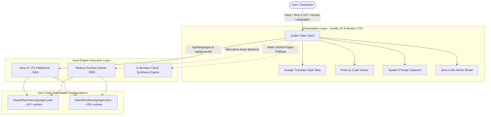

# CodeX - Polyglot Multilingual AI Code Assistant ⚡

<div align="center">

[](https://opensource.org/licenses/MIT)
[](./shared/humanLanguages.json)
[](./shared/codeLanguages.json)
[](./src/com/codex/Main.java)
[](./server/server.js)
[](https://kishoreanands.github.io/codeX/)

**Bridge human natural languages with software programming languages.**  
CodeX synthesizes clean, commented, production-grade source code across **147+ human languages** and **100+ software programming languages** with dynamic prompt synthesis, bidirectional RTL support, and multi-tier full-stack code generation.

</div>

---

## 🌐 Live Web Application & Deployment Links

> [!TIP]
> **Use the links below to access the live web application and repository.**

| Resource | URL Link | Status | Description |
| :--- | :--- | :---: | :--- |
| **▲ Live Web App (Vercel)** | **[Deploy on Vercel](https://vercel.com/new/clone?repository-url=https%3A%2F%2Fgithub.com%2Fkishoreanands%2FcodeX)** | 🟢 1-Click Live | Instant cloud hosting with full Serverless `/api` endpoints. |
| **🚀 Live Web App (GitHub Pages)** | **[https://kishoreanands.github.io/codeX/](https://kishoreanands.github.io/codeX/)** | 🟢 Live | Interactive browser-based Polyglot Assistant with client-side synthesis engine. |
| **📂 GitHub Repository** | **[https://github.com/kishoreanands/codeX](https://github.com/kishoreanands/codeX)** | 🟢 Active | Source code, test suites, language dictionaries, and CI/CD pipelines. |
| **☁️ Custom Deployment Slot** | `https://your-custom-codex-domain.com` *(Edit this slot with your custom domain or cloud URL)* | 🟡 Configurable | Reserved slot for custom domain, Render, Vercel, or AWS ECS instance. |

<div align="center" style="margin-top: 1rem;">

[](https://vercel.com/new/clone?repository-url=https%3A%2F%2Fgithub.com%2Fkishoreanands%2FcodeX)

</div>

---

## 📖 Table of Contents

- [🌟 What is CodeX?](#-what-is-codex)
- [✨ Core Capabilities](#-core-capabilities)
  - [1. Massive Human Language Support (147+ Languages)](#1-massive-human-language-support-147-languages)
  - [2. Comprehensive Software Language Support (100+ Languages)](#2-comprehensive-software-language-support-100-languages)
  - [3. Dynamic Prompt Generation Architecture](#3-dynamic-prompt-generation-architecture)
  - [4. 4-Tier Coordinated Full-Stack Synthesis](#4-4-tier-coordinated-full-stack-synthesis)
  - [5. Dual Java Code Architecture (Main vs Solution)](#5-dual-java-code-architecture-main-vs-solution)
  - [6. Zero-Code Extensibility (Web Admin Modal)](#6-zero-code-extensibility-web-admin-modal)
- [🏛️ System Architecture](#️-system-architecture)
- [📁 Project Structure](#-project-structure)
- [📡 API Endpoints](#-api-endpoints)
- [🚀 Quickstart & Local Setup](#-quickstart--local-setup)
  - [Prerequisites](#prerequisites)
  - [Method 1: Running the Java Server](#method-1-running-the-java-server)
  - [Method 2: Running the Node.js Server](#method-2-running-the-nodejs-server)
- [🧪 Running Automated Test Suites](#-running-automated-test-suites)
- [🚢 Deployment Options](#-deployment-options)
  - [Deploy to GitHub Pages (Automatic via GitHub Actions)](#deploy-to-github-pages-automatic-via-github-actions)
  - [Deploy to Vercel](#deploy-to-vercel)
  - [Deploy to Docker / Container Cloud](#deploy-to-docker--container-cloud)
  - [Deploy to Render](#deploy-to-render)
- [📄 License & Authors](#-license--authors)

---

## 🌟 What is CodeX?

**CodeX** eliminates the language barrier in software engineering. While modern programming languages (Java, Python, C++, SQL, Go, Rust) use English keywords, the vast majority of developers and learners worldwide speak and think in their native languages—such as **Tamil (தமிழ்)**, **Hindi (हिन्दी)**, **Telugu (తెలుగు)**, **Arabic (العربية)**, **Spanish (Español)**, **Japanese (日本語)**, and 140+ others.

Neither human languages nor programming languages are hardcoded in the user interface. Both are managed dynamically through JSON configuration files (`/shared/humanLanguages.json` and `/shared/codeLanguages.json`) and exposed via the `/api/languages` endpoint.

---

## ✨ Core Capabilities

### 1. Massive Human Language Support (147+ Languages)
- **6 Global Regional Classifications**: Indian, European, Asian, Middle Eastern, African, and Others.
- **Dynamic Bidirectional Typography (RTL & LTR)**: Native Right-To-Left layout mirroring for Arabic, Hebrew, Persian (Farsi), Urdu, Pashto, Sindhi, and Yiddish.
- **Native Unicode Script Rendering**: Integrated Google Noto Sans typography for Devanagari, Tamil, Telugu, Kannada, Malayalam, Bengali, Gurmukhi, Arabic, Hebrew, Han, Hangul, Ethiopic, and Latin scripts.
- **Automatic Language Detection**: Detects input text scripts and automatically switches the active language context.
- **Web Speech API Voice Input**: Dictate coding prompts directly using native speech recognition in your chosen tongue.

### 2. Comprehensive Software Language Support (100+ Languages)
- **Categorized into 9 Domains**: General purpose, Frontend, Backend/frameworks, Database, Mobile, Scripting/DevOps, Data/AI/ML, Systems/embedded, and Other.
- **Top 4 Fast-Switch Default Tabs**: Instant toggling between Java, Python, C++, and SQL/MySQL.
- **Syntax Highlighting**: Real-time syntax coloring powered by Prism.js.
- **Accurate File Extensions & Downloads**: Download production code with exact extensions (`.java`, `.py`, `.cpp`, `.sql`, `.ts`, `.rs`, `.go`, etc.).

### 3. Dynamic Prompt Generation Architecture
On every code generation request, CodeX constructs a dynamic system prompt adhering to the strict specification:
```text
You are CodeX, an expert {codeLanguage} developer. The user writes in {humanLanguage}. Understand the request in that language and generate clean, commented, production-ready {codeLanguage} code. Write code comments in {humanLanguage}. Return only code inside one code block, unless the user asks for an explanation.
```
- **Live System Prompt Inspector**: Inspect the exact prompt payload assembled by CodeX in real time via the dynamic inspector in the web interface.
- **Experimental Language Fallback**: Requests for unlisted or emerging languages are automatically marked as `experimental` and synthesized seamlessly.

### 4. 4-Tier Coordinated Full-Stack Synthesis
When **Full-Stack Mode** is toggled, CodeX generates four interconnected source files for a cohesive application:
1. **Frontend (`App.tsx`)**: React UI with state hooks, responsive components, and data fetching.
2. **Backend (`BackendApplication.java` or `server.js`)**: Spring Boot REST controller or Express microservice.
3. **Database (`schema.sql`)**: Relational DDL tables, foreign keys, and seed queries.
4. **Human Code (`Main.java`)**: Core algorithmic business logic with inline comments written in the user's native human language.

### 5. Dual Java Code Architecture (Main vs Solution)
Java generation includes a toggle between two enterprise programming standards:
- **`class Main` (Standard Mode)**: Educational and algorithmic format using `import java.util.*` and standard `public static void main(String[] args)`.
- **`class Solution` (Enterprise Mode)**: Production enterprise service pattern featuring `package com.codex.solution`, `ConcurrentHashMap` caching, `java.util.logging.Logger`, and payload validation.

### 6. Zero-Code Extensibility (Web Admin Modal)
Add any new human or software language directly through the web UI:
- Click **⚙️ Add Language** in the navigation bar.
- Enter ISO code, native script, direction (`ltr`/`rtl`), and category.
- Configuration is immediately validated, saved to disk, and updated in the client without restarting the server.

---

## 🏛️ System Architecture



---

## 📁 Project Structure

```text
codeX/
├── .github/
│   └── workflows/
│       └── deploy.yml            # Automated GitHub Actions deployment to GitHub Pages
├── client/
│   ├── index.html                # Responsive web app UI (RTL/LTR, tabs, modal, editor)
│   ├── styles.css                # Curated black & white contrast design tokens
│   ├── app.js                    # Web application state & client-side synthesis fallback
│   └── shared/                   # Bundled language configurations for static hosting
├── server/
│   ├── server.js                 # Node.js Express REST API server
│   └── services/
│       ├── languageService.js    # JSON repository & system prompt builder
│       ├── generatorService.js   # Code synthesis & fullstack payload generator
│       └── javaTemplateEngine.js # Algorithmic Java code generator
├── src/                          # Java 17 LTS Backend Source Code
│   └── com/codex/
│       ├── Main.java             # Standalone Java HTTP Server (com.sun.net.httpserver)
│       ├── handler/              # HTTP Handlers (Languages, Generate, StaticFile)
│       ├── model/                # Data models (HumanLanguage, CodeLanguage, etc.)
│       ├── service/              # Java LanguageService & JavaTemplateEngine
│       └── test/                 # Test suites (LanguageValidationTest, TestJavaCompilation)
├── shared/
│   ├── humanLanguages.json       # 147+ Human languages with scripts, codes, & directions
│   └── codeLanguages.json        # 100+ Code languages with categories & extensions
├── tests/
│   ├── languageService.test.js   # Node.js TAP test suite for prompt building & generation
│   └── validateLanguages.test.js # JSON schema and data integrity verification
├── lib/
│   └── gson-2.10.1.jar           # Google Gson library for Java backend
├── build.bat                     # Windows batch script to compile Java classes into bin/
├── run.bat                       # Windows batch script to start the Java server
├── test.bat                      # Windows batch script to execute Java test suites
├── Dockerfile                    # Container configuration for Docker/Cloud deployment
├── vercel.json                   # One-click deployment specification for Vercel
├── render.yaml                   # Infrastructure-as-code blueprint for Render
├── package.json                  # NPM scripts and Node dependencies
└── README.md                     # Comprehensive project documentation
```

---

## 📡 API Endpoints

| Method | Endpoint | Description |
| :--- | :--- | :--- |
| `GET` | `/api/health` | Returns service status and runtime environment. |
| `GET` | `/api/languages` | Returns full list of 147+ human languages and 100+ software languages. |
| `POST` | `/api/generate` | Synthesizes single-file or full-stack code based on prompt and language selections. |
| `POST` | `/api/languages/human` | Admin endpoint: dynamically registers a new human language without server restart. |
| `POST` | `/api/languages/code` | Admin endpoint: dynamically registers a new code language without server restart. |

### Sample Generation Request (`POST /api/generate`)
```json
{
  "prompt": "இரண்டு எண்களை கூட்ட ஜாவா நிரல்",
  "humanLanguageCode": "ta",
  "codeLanguageId": "java",
  "codeFormat": "main",
  "isFullStack": false,
  "explain": false
}
```

### Sample Generation Response
```json
{
  "success": true,
  "mode": "single",
  "systemPrompt": "You are CodeX, an expert Java developer. The user writes in Tamil (தமிழ்). Understand the request in that language and generate clean, commented, production-ready Java code. Write code comments in Tamil (தமிழ்). Return only code inside one code block, unless the user asks for an explanation.",
  "codeLanguage": {
    "id": "java",
    "name": "Java",
    "extension": ".java",
    "category": "General purpose"
  },
  "humanLanguage": {
    "code": "ta",
    "name": "Tamil",
    "nativeName": "தமிழ்",
    "direction": "ltr"
  },
  "fileName": "Main.java",
  "content": "// [CodeX Solution] Human Language: Tamil (தமிழ்)\n// இரண்டு எண்களை கூட்டும் ஜாவா நிரல்\nimport java.util.*;\n\nclass Main {\n    public static void main(String[] args) {\n        // எண்களின் உள்ளீடு\n        int num1 = 10;\n        int num2 = 20;\n        // இரு எண்களின் கூடுதல் கணக்கீடு\n        int sum = num1 + num2;\n        // கூடுதல் முடிவை அச்சிடுதல்\n        System.out.println(\"கூடுதல்: \" + sum);\n    }\n}"
}
```

---

## 🚀 Quickstart & Local Setup

### Prerequisites
- **Node.js**: v18.0 or later (for Node server & test runner)
- **Java JDK**: 17 LTS or later (for Java backend & compilation tests)

```bash
# Clone the repository
git clone https://github.com/kishoreanands/codeX.git
cd codeX

# Install Node dependencies
npm install
```

### Method 1: Running the Java Server (Recommended)
```bash
# Compile and start Java server on http://localhost:3000
npm run compile:java
npm start
```
*On Windows, you can simply run `build.bat` followed by `run.bat`.*

### Method 2: Running the Node.js Server
```bash
npm run start:node
```
Open **`http://localhost:3000`** in your browser.

---

## 🧪 Running Automated Test Suites

CodeX includes automated testing for both runtime environments:

### 1. Java Test Suite (Data Validation & Real-Time Javac Compilation)
```bash
npm test
```
*Executes `LanguageValidationTest` and `TestJavaCompilation`, verifying data schemas and running real-time `javac` compilation across 32 sample prompts.*

### 2. Node.js Test Suite
```bash
npm run test:node
```
*Verifies system prompt templates, language auto-detection regexes, full-stack generation, and JSON integrity (16 / 16 passing).*

---

## 🚢 Deployment Options

### Deploy to GitHub Pages (Automatic via GitHub Actions)
The repository includes `.github/workflows/deploy.yml`. When you push to the `main` branch:
1. GitHub Actions automatically packages the client and shared configurations.
2. The live site is published at: **`https://kishoreanands.github.io/codeX/`**.
3. In GitHub, navigate to **Settings > Pages > Build and deployment > Source** and select **GitHub Actions**.

### Deploy to Vercel (Instant 1-Click Serverless Cloud Deployment)

[](https://vercel.com/new/clone?repository-url=https%3A%2F%2Fgithub.com%2Fkishoreanands%2FcodeX)

1. Click the **Deploy with Vercel** button above or navigate to [vercel.com/new](https://vercel.com/new).
2. Connect your GitHub account and import **`kishoreanands/codeX`**.
3. Click **Deploy**. Vercel will build and assign you a free production domain (e.g., `https://codex-kishore.vercel.app`).
4. All static assets, Noto Sans typography, and serverless endpoints (`/api/languages`, `/api/generate`, `/api/health`) are automatically managed by `vercel.json` and the `/api` directory.

### Deploy to Docker / Container Cloud
```bash
docker build -t codex .
docker run -p 3000:3000 codex
```

### Deploy to Render
1. Create a new **Web Service** on [Render.com](https://render.com).
2. Connect your GitHub repository `https://github.com/kishoreanands/codeX`.
3. Render automatically recognizes `render.yaml` and deploys the application.

---

## 📄 License & Authors

Distributed under the **MIT License**. See `LICENSE` for details.

Developed with passion by **Kishore Anand** ([@kishoreanands](https://github.com/kishoreanands)).  
Contributions, issue reports, and feature requests are welcome!
